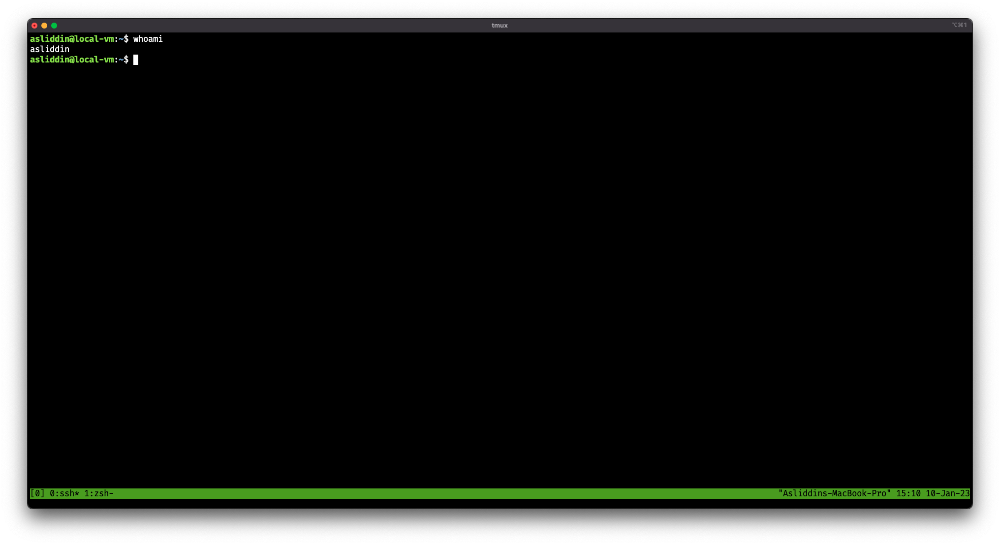

# Linux. Who am i?

Ushbu qismda biz Linux operatsion tizimini (keyingi o'rinlarda OS) o'rganishni boshlaymiz. Ushbu OS deyarli barcha joyda, telefonimizdan tortib, gigant serverlargacha joylashib olgan 👀. Bundan kelib chiqadiki, bu tizimni bilmaslik dasturchi uchun uyat bo'ladi 🥹.

Tizimni qanday o'rnatish haqida hech nima demoqchi emasman. Chunki bu haqida [Youtube](https://youtube.com) orqali ko'p narsa topishingiz mumkin. Yoki biror kuni o'rnatish haqida video ham tayyorlab qo'yarman :innocent:.

Xo'sh, linux bilan ishlash uchun bizga nima kerak? Birinchi o'rinda Terminal (agar Windows foydalanuvchisi bo'lsangiz, sizda bu Powershell yoki Cmd deya nomlangan). Undan so'ng esa bor yo'g'i Web-Browser kerak bo'ladi. Butun boshli OS ni oddiygina terminal orqali boshqarish mumkin. Keling, ko'p gapirmasdan birinchi komandamizni ishlatib ko'raylik. Buning uchun avvalo Terminal ni ochib olamiz. Ko'plab distributivlarda Ctrl-Alt-T klavishlarini birgalikda bosish orqali Terminalni ishga tushirish mumkin. Agar bu buyruq ish bermasa, Applications menyusi orqali Terminal ni ochib olasiz.

Terminal ishga tushganda quyidagicha ko'rinishda ochiladi:

<figure><figcaption>
Terminal ko'rinishi
</figcaption></figure>

Bu yerda **asliddin** - bu mening foydalanuvchi nomim, **local-vm** esa kompyuterim nomi.

Linux bilan ishlashda biz terminal emulyatorlari bilan ishlashimiz kerak bo'ladi. Odatiy holda bular bash yoki sh terminal emulyatorlaridan biri bo'lishi mumkin. Hozirgi yangi versiyadagi OS larda zsh ommalashmoqda. Bu bizga nima beradi? Biz bu emulyatorlar orqali buyruqlarimizni OS ga bera olamiz.

<figure><figcaption>
Bash va sh terminal emulyatorlari
</figcaption></figure>

Ularning bir-biridan farqi faqatgina sizga ko'rsatadigan ma'lumotlaridadir ya'ni bir-biridan deyarli farq qilmaydi.

Keling, terminalda turib bizning tizimga login qilgan foydalanuvchimiz nomini bilishga harakat qilaylik: &#x20;

<figure><figcaption>
whoami buyrug'i
</figcaption></figure>

`whoami` ushbu buyruq bizga kim ekanimizni ko'rsatib beradi. Bu buyruq inglizchadan "Men kimman?" degan ma'noni bildiradi. Ushbu buyruq haqida quyidagicha ma'lumot olishimiz mumkin:

<figure><figcaption>
whoami --help
</figcaption></figure>

`--help` ushbu buyruq `flag` deb ataladi va deyarli barcha buyruqlarda mavjud bo'ladi. Bu `flag`ning vazifasi biz ishlatmoqchi bo'lgan buyruqning nima vazifa bajarishi haqida ma'lumot berish va qo'shimcha qanday `flag` larga ega ekanligini ko'rsatishdan iboratdir. Keling `--version` flagini ham ishlatib ko'ramiz:

<figure><figcaption>
whoami --version
</figcaption></figure>

Ma'lumotga ko'ra biz `whoami` buyrug'ining 8.32 versiyasini ishlatyapmiz. Qo'shimcha ma'lumot sifatida esa, buyruq ishlab chiqaruvchisi `Richard Mlynarik` ekanligini berdi.

Keling, endi `--help` dan boshqa yo'sinda ham buyruq haqida ma'lumot olib ko'raylik:&#x20;

<figure><figcaption>
man whoami
</figcaption></figure>

`man <buyruq>`ushbu ko'rinishda biz Linux tizimining istalgan buyrug'ining manuallarini o'qib olishimiz mumkin bo'ladi. Buyruqni yozgach `<Enter>` tugmasini bosing va quyidagi ma'lumotlar Terminalda ko'rinadi:

<figure><figcaption>
man whoami &#x3C;Enter>
</figcaption></figure>

Ko'rib turibmizki, bu yerda nisbatan ancha ko'p ma'lumot berilmoqda. Sizga qanday usulda qulay bo'lsa, shu usulda foydalanish huquqiga egasiz. Hech kim urushmaydi ☺️. Bemalol foydalanish mumkin. Keyingi safar esa qanday qilib parolimizni o'zgartirish, yangi foydalanuvchilarni qo'shish haqida gaplashamiz 🥸
